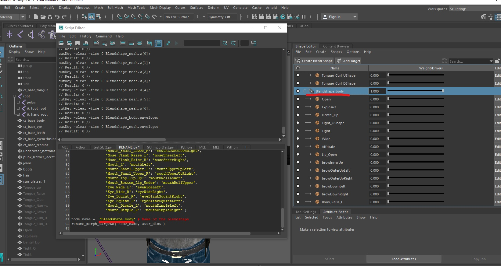

# Software that should be downloaded already by this page
 * Maya student version download here: https://www.autodesk.com/education/free-software/maya
 * Unreal downloaded here: https://www.unrealengine.com/en-US/get-now/agnostic

# In Maya from MakeHuman/Blender:
After you created the model in Blender, and it is exported as a FBX, open the file in Maya. Make sure to delete the default cube, light, and camera from the Blender scene first.

Once you import the model in Maya you should scale the bone joint size. In the toolbar look for Display > Animation > Joint Size. Scale it down to whatever is comfortable for you. This is to make it easier to see the animation of the blendshapes. 

Then switch the workspace mode to sculpting this will layout the blendshapes in a easier way to see. 

  - **Editing Blendshapes in Maya from MakeHuman:**
  - Once you make the switch, you will see a bunch of orange targets, these are the blendshapes. You can toggle between how strong you want each target to be for animation purposes. It’s basically like a light dimmer.


When you open up the model in maya, you should see one blendshape group, in this example its called “Body_ncl1_4” rename it to **Blendshape_mesh**. 


   - **Merging Blendshapes in MakeHuman:**
      - The two blendshapes that need merging are:
         - mouth_narrow_left and mouth_narrow_right = **mouthPucker**
         - cheek_balloon_left and cheek_balloon_right = **cheekPuff**

Be sure to rename Brow_squeeze = **browInnerUp**  This one is already merged! But just needs to be a different name so it can work with Apple!!

In maya, you want to locate these two pairs of blendshapes and merge them. In order to merge the two targets correctly you will need to select them both, for example “mouth_narrow_left and mouth_narrow_right” and drag the toggles all the way to the right and right click into them and hit merge.  Once they are merged you need to look for it again and there will only be one name, select it and rename it mouthPucker, it has to be exactly spelled like that.  Repeat the steps for cheek_balloon_left and cheek_balloon_right. 


# Running the script in Maya
This step is after you completed designing your 3D character in your specific software of your choosing. 

# Using Python in Maya
There are no plugins required for this step. To use this script you want to open Maya and open the script editor at the bottom right. 


Once you have the window open, select the python tab. If you do not see one, hit the "+" and choose python and the tab will have the label Python. 

Now once you name your blendshape group is changed to "Blendshape_mesh" and all the necessary targets are merged you can run our script!


# Running Python

Once you open the script editor there should be a MEL tab and a Python tab. If not you can hit the "+" on the far right of the tabs and select "Python". Open the Python tab and just copy and paste the code below into the maya script editor


Then scroll all the down the code until you see a some yellow and red words, please refer to the screenshot below.


Next, you want insert the "Blendshape_whatever" name in between the '' after you type in the name, you can hit the execute all button at the top.


Once the code executes, the specific target blendshapes should have changed to camel case naming convention.

Like so in this screenshot. 



**Now scroll all the way down this page to see the next steps!**
------------------------------------------------------------------------------------------------------------------------------------------------------------------------

```Python
import maya.cmds

def rename_morph_targets( node_name, attr_dict, quiet = False ):
	# list to catch our failures	
	fail_list = [ ]

	# How many targets there are in the alias list
	number_of_targets = maya.cmds.getAttr( '{0}.weight'.format( node_name ), size = True )

	# Iterate through the weight list
	for index in range( 0, number_of_targets ):
		# Query the name of the current blendshape weight
		old_name = maya.cmds.aliasAttr( '{0}.weight[{1}]'.format( node_name, index ), query = True )

		# If the old name isn't in the attr_dict, we're going to pass on it.
		if old_name in attr_dict.keys( ):
			# We're going to rename
			new_name = attr_dict[ old_name ]
			print 'Found old name: ', index, new_name, old_name
			
			absolute_name = '{0}.weight[{1}]'.format( node_name, index )

			maya.cmds.aliasAttr( new_name, absolute_name ) # Re-aliasing / Renaming occurs here.
			if not quiet:
				print 'Changed {0} -> {1}'.format( old_name, new_name )
				
		# Add the failure to the fail list		
		else:
			fail_list.append( old_name )

	if fail_list:
		maya.cmds.warning( '{0} names were not changed. Check console for details'.format( len( fail_list ) ) )
		for name in fail_list:
			print name

attr_dict = { 'brow_outer_down_left': 'eyeBlinkLeft',
                'brow_outer_down_right': 'eyeBlinkRight',
                'brow_mid_down_left': 'browDownLeft',
                'brow_mid_down_right': 'browDownRight',
                'brow_outer_up_left': 'browOuterUpLeft',
                'brow_outer_up_right': 'browOuterUpRight',
                'mouth_down_left': 'mouthFrownLeft',
                'mouth_down_right': 'mouthFrownRight',
                'mouth_open': 'jawOpen',
                'mouth_down_left': 'jawLeft',
                'mouth_down_right': 'jawRight',
                'mouth_corner_down_left': 'mouthLowerDownLeft',
                'mouth_corner_down_right': 'mouthLowerDownRight', 
                'mouth_corner_in_left': 'mouthLeft',
                'mouth_corner_in_right': 'mouthRight',
                'lips_mid_lower_up_left': 'mouthUpperUpLeft',
                'lips_mid_lower_up_right': 'mouthUpperUpRight',
                'brow_squeeze': 'browInnerUp'  }

node_name = '' # Name of the blendshapes
rename_morph_targets( node_name, attr_dict )
```

------------------------------------------------------------------------------------------------------------------------------------------------------------------------

### After blendshape targets are renamed you can export this model as a FBX and import into Unreal! 

**You can go to file > Export all > make sure the file type is FBX and then save it to a location on your computer.**

# The next steps are [here](https://github.com/RLabNYC/Rlab_FaceTracking_mkhu/blob/master/IMPORTING.md)

## If you need to go back to the table of [contents](https://github.com/RLabNYC/RLab_Facetracking). For the Make Human modeling steps go [here](https://github.com/RLabNYC/Rlab_FaceTracking_mkhu)
